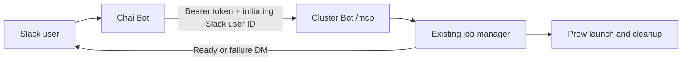

# OCPCRT-767: User-attributed cluster management through embedded MCP

## 1. Summary and agreed scope

Implement [OCPCRT-767](https://redhat.atlassian.net/browse/OCPCRT-767) by adding an authenticated MCP endpoint to the existing Cluster Bot process:

**`https://ci-chat-bot-ci.apps.ci.l2s4.p1.openshiftapps.com/mcp`**



The implementation will:

- Support ordinary Prow launches using existing versions, release images, PR inputs, platforms, architectures, and launch options.
- Expose all five tools: launch, status, credentials, list, and destroy.
- Preserve the initiating user’s ownership, per-user limits, Prow namespace access, and automatic cleanup.
- Allow Chai to manage the user’s ordinary Prow clusters created through either Slack or MCP.
- Send completion/failure notifications through Cluster Bot DMs and return credentials through MCP when requested.
- Require a stable launch `request_id` for retries.

ROSA, MCE, workflow commands, standalone builds/tests, and updating an existing cluster with PR-built images are outside this implementation. Existing clusters from those workflows must still count wherever current launch admission rules require them.

There is no cluster REST API in this checkout. Embedded MCP will call a structured manager interface directly.

## 2. MCP tool contract

Every tool requires `slack_user_id`. A job ID alone never authorizes access.

| Tool | Additional inputs | Successful result |
|---|---|---|
| `launch_cluster` | Required `request_id`, `inputs: string[]`; optional `platform`, `architecture`, `parameters: map[string]string` | Job ID, initial/current status, resolved launch settings, available logs URL, whether the request was replayed |
| `get_cluster_status` | `job_id` | Cluster summary, lifecycle status, available console/API URLs, sanitized failure details |
| `get_cluster_credentials` | `job_id` | Kubeconfig, available console/API URLs, console username/password, access instructions |
| `list_clusters` | None | Active ordinary Prow clusters owned by the user, regardless of launch entry point |
| `destroy_cluster` | `job_id` | Job ID and termination status; confirms shutdown was requested, not that cloud cleanup has finished |

**Launch inputs and defaults**

- `inputs` represents the existing single launch input group: one version or release image, optionally accompanied by PR references. Preserve the existing requirement for an explicit valid version/image.
- Omitted platform and architecture use the same defaults as Slack launches, including the existing HyperShift selection rules.
- `parameters` exposes existing launch parameters. Flag-style options use an empty string value.
- Reject unknown parameters, unsupported combinations, and the launch-incompatible `test` parameter.
- Do not accept caller-supplied ownership, notification channel, job name, backend credentials, or lifetime overrides.
- Describe platform availability as dependent on configured Prow jobs; inclusion in the supported-platform list does not guarantee every combination is available.

**Structured results**

Define explicit `ClusterSummary`, `ClusterCredentials`, `LaunchResult`, `TerminationResult`, and `ToolError` DTOs. Never serialize the internal manager `Job` directly.

Summaries contain identifiers, ownership, launch settings, timestamps, status, logs URL, and non-secret access URLs. Kubeconfig, passwords, and credential-bearing snippets appear only in the credentials result.

Use these lifecycle states:

- `provisioning`
- `ready`
- `failed`
- `terminating`
- `terminated`
- `expired`

`ready` means the existing monitor has obtained credentials and passed its readiness checks. A successful terminal ProwJob means the launch job has ended; it does **not** mean the cluster has just become ready. Terminal and expiry conditions override cached credentials.

Return successful data under `data`. Domain failures use `error: {code, message, retryable, job_id?}` and MCP `isError: true`. Define stable codes for invalid arguments/identity, an existing active cluster, capacity exhaustion, request conflicts, launch initialization, missing jobs, unavailable credentials, backend unavailability, and internal failures. Unknown and other-owned job IDs both return `NOT_FOUND`.

Tool descriptions must explain asynchronous provisioning, request-ID reuse, ownership, credential sensitivity, and the meaning of termination. Supply input/output schemas and accurate read-only/destructive annotations.

## 3. Implementation changes

### Transport, configuration, and authentication

Add a dedicated MCP package and mount it on the existing HTTP mux in [the HTTP startup code](../cmd/ci-chat-bot/slack.go).

- Use the official Go MCP SDK, pinned to `v1.8.0`, with Streamable HTTP, stateless handling, and JSON responses. The SDK supports current and older Streamable HTTP protocol revisions; exercise that compatibility in integration tests. [SDK release](https://github.com/modelcontextprotocol/go-sdk/releases/tag/v1.8.0), [transport documentation](https://github.com/modelcontextprotocol/go-sdk/blob/v1.8.0/docs/protocol.md).
- Introduce `--mcp-token-file` and `--mcp-public-url`. An omitted token file disables MCP; explicitly return 404 for `/mcp` instead of allowing the existing root handler to return a misleading 200.
- When enabled, reject missing/empty secrets and invalid configuration at startup. Load the token through the existing secret-agent mechanism and support rotation without rebuilding the image.
- Authenticate every MCP HTTP request with a constant-time bearer-token comparison. Map the token to the server-controlled service principal `chai`; do not derive that principal from MCP client metadata.
- Apply authentication before protocol handling. Validate supplied Origin headers against the configured public origin, permit requests without Origin for service clients, and cap request bodies at 1 MiB.
- Bound launch submission work with a 60-second context. Propagate cancellation through submission dependencies. Once a ProwJob exists, its lifecycle and monitoring continue independently of the HTTP connection.

This is a configured service-token integration. An OAuth authorization server and legacy SSE endpoint are outside v1.

### Identity, ownership, and notifications

Chai is trusted to assert the actual initiating Slack user. Verifying a Slack profile confirms the claimed identity exists; it does not prove who initiated the Chai conversation.

- Resolve `slack_user_id` using Cluster Bot’s Slack client. Require an active human user in the bot’s workspace and a usable Red Hat email address.
- Derive the existing Red Hat username from that verified email. Do not accept a caller-supplied RBAC username.
- Populate `JobRequest.User` with the Slack user ID and `JobRequest.UserName` with the derived username. Preserve their existing Prow annotations and recovery behavior.
- Require ownership checks inside manager operations for status, credentials, listing, and destruction, not just in MCP handlers.
- Open or retrieve the initiating user’s DM using Slack. Persist that channel through the existing notification mechanism.
- Resolve the DM before creating a new launch. If identity validation or DM creation fails, return an actionable error without submitting a ProwJob.
- Replayed launches return the existing result without creating another DM notification.
- Preserve current notification-delivery semantics; exactly-once Slack delivery is not part of this issue.

Chai’s connection setup must ensure the user ID comes from its trusted conversation context, rather than allowing a conversational request to select another user.

### Shared manager operations and launch admission

The current [launch implementation](../pkg/manager/manager.go) mixes orchestration with Slack text and represents successful submissions as errors. Refactor the common behavior into typed operations.

Introduce a focused `ClusterManager` interface with context-aware methods for submitting, inspecting, listing, retrieving credentials, and terminating ordinary Prow launches. Keep existing Slack-facing methods as compatibility wrappers, so unrelated commands and mocks do not require wholesale migration.

- Extract shared option validation/defaulting from Slack-specific parsing. Slack continues parsing command text; MCP passes typed fields into the same validation rules.
- Share input resolution, job selection, cloud-profile selection, admission checks, Prow submission, and monitoring between Slack and MCP.
- Separate ProwJob creation from waiting for its logs URL. MCP returns after durable ProwJob acceptance; the existing wait can take five minutes and must not block MCP.
- Return genuine errors for failed operations. Preserve existing Slack messages by formatting typed results in the compatibility path.
- Perform admission and reservation atomically under the manager lock. Concurrent Slack and MCP requests must not acquire separate slots for the same user.
- Check capacity before committing reservations. Roll back only the matching request’s reservation after a definite pre-submission failure.
- Keep network calls outside the global manager lock.
- Preserve existing lifetime calculations, Prow cleanup configuration, platform restrictions, operator-install behavior, and active-ROSA launch exclusions.

Wire notification callbacks before manager recovery. Complete initial Prow and enabled ROSA inventory reconstruction before accepting launches, so a restart cannot temporarily bypass limits.

### Durable launch retries and recovery

Use ProwJobs as the durable record; add no database.

- Scope `request_id` by authenticated service principal and Slack user ID.
- Derive a deterministic, Kubernetes-valid ProwJob name from that scope and request ID.
- Persist the full request-key hash, a canonical input fingerprint, and request source in namespaced annotations, alongside existing ownership metadata.
- Fingerprint the requested inputs before dynamic release resolution/default selection. Retrying `nightly` must recover the original launch even if the current nightly changes.
- Before resolving inputs or creating a new launch, look up the deterministic ProwJob name. Validate ownership and both hashes.
- Identical retries return the original job, including terminal results. Reusing an ID with different arguments returns `REQUEST_CONFLICT`.
- Concurrent identical submissions create at most one ProwJob. While submission is still underway, return a retryable initialization result or the accepted job once available.
- Treat Kubernetes `AlreadyExists` as a reconciliation case, verifying the stored record before reuse.
- After an ambiguous create timeout, reconcile by deterministic name. Tell the caller to retry with the same request ID; never silently allocate another name.
- Recover ownership, source, and retry metadata after restart. Use direct ProwJob reads when the informer or short-lived in-memory cache cannot answer reliably.

Deduplication lasts while the ProwJob is retained. The checked deployment configuration uses **24-hour ProwJob retention**. Document that bound: clients must not replay an old launch after retention and expect permanent deduplication.

### Status, credentials, and exact-job destruction

- Return immutable snapshots assembled under the manager lock; deep-copy mutable maps/slices crossing that boundary.
- List only the verified owner’s active ordinary Prow launches. Do not reuse the existing Slack list’s broader visibility.
- Populate structured console URL and password fields when the monitor reads the Kubernetes Secret. Derive the API URL from the kubeconfig using the existing Kubernetes client libraries.
- Keep Slack credential formatting separate from these fields. Never parse passwords or URLs back out of Slack-formatted text.
- During restart credential recovery, report credentials as unavailable until the existing monitor has reconstructed them.
- Refuse credential retrieval for failed, terminating, terminated, or expired clusters.

Implement destruction by **owner plus exact job ID**:

- Validate the persisted ProwJob’s ownership and launch mode.
- Request cancellation through Prow, retaining the ProwJob for status and retry recovery.
- Persist a termination marker and apply the abort transition with conflict retries. Handle accepted jobs that have not yet created a pod.
- Make repeated destruction requests for the same retained job safe.
- Clear the owner’s active reservation only if it still refers to that job.
- Prevent late monitor results from restoring credentials or overwriting terminal state.
- Never resolve an old job ID to the user’s newer cluster.
- Report termination as a job lifecycle result; infrastructure reclamation remains asynchronous under existing cleanup.

### Observability

Add MCP operation count and duration metrics labeled by bounded tool name and outcome. Record structured audit events with service principal, Slack user ID, job ID, request-key hash, operation, and outcome.

Do not log bearer tokens, kubeconfigs, passwords, full credential responses, or raw MCP request/response bodies. Add `/mcp` to HTTP metric path normalization.

## 4. Verification and acceptance criteria

Use fake Kubernetes/Prow clients, injected Slack dependencies, and an HTTP test server with the official MCP client.

| Area | Required scenarios |
|---|---|
| Protocol/authentication | Discovery and calls over Streamable HTTP; invalid/missing tokens; disabled endpoint; token rotation; Origin rejection; malformed/oversized inputs |
| Attribution | Correct Slack ownership and derived RBAC username; invalid/deactivated/bot identities; Slack lookup failure; DM creation failure before submission |
| Ownership | User A cannot inspect, retrieve credentials for, or destroy user B’s job; listing includes only A’s eligible clusters |
| Shared limits | Slack launch blocks a second MCP launch and vice versa; concurrent submissions admit one; capacity rejection leaves no stale reservation |
| Launch behavior | Versions/images plus PRs; shared defaults; unsupported options/combinations; operator readiness; acceptance before logs URL exists |
| Retries | Identical and conflicting request IDs; concurrent retries; `AlreadyExists`; lost response after create; ambiguous create timeout; replay after restart |
| Recovery | Existing jobs count before new admission; active ownership survives restart; credentials recover without changing job identity |
| Credentials | Secret-free summaries/errors/logs; premature and terminal retrieval rejected; structured access details match existing credential sources |
| Destruction | Exact-ID targeting; repeated requests; early provisioning cancellation; destroy old job after replacement launch; monitor/destroy races |
| Regression | Slack launch/auth/done behavior, notifications, limits, expiry, and automatic cleanup remain functional |

Run focused tests with `-race` and `GOFLAGS=-tags=gcs`, followed by the repository-required:

```bash
make verify lint test all
```

End-to-end acceptance requires:

1. Chai launches for user A and receives a stable job ID.
2. A receives the Cluster Bot completion DM and can retrieve working access details through Chai.
3. Slack and Chai enforce the same active-cluster limit.
4. User B cannot access A’s cluster.
5. A lost response and a bot restart both recover the original launch through the same request ID.
6. Destruction targets the specified cluster, and automatic expiry still cleans up a separately tested launch.

## 5. Delivery sequence and operating assumptions

Deliver in four reviewable stages:

1. **Manager groundwork:** typed operations, shared validation, prompt Prow acceptance, snapshots, exact-job termination, and regression tests.
2. **Retry/recovery support:** deterministic names, persisted metadata, startup admission gating, and concurrency tests.
3. **MCP integration:** SDK dependency and vendoring, authentication, identity resolution, five tools, metrics, and connection documentation.
4. **Deployment and Chai validation:** secret/config rollout, local/dev smoke tests, then the end-to-end acceptance sequence.

Keep MCP disabled until deployment configuration and the Chai connection are ready. Use the existing bot deployment and the user-confirmed public URL. Retain one active manager instance and configure deployment updates to avoid overlapping instances while admission relies on process-local locking.

The companion deployment change must mount the bearer secret, configure the two MCP flags, and verify HTTPS reachability from Chai’s GKE environment. Document the required Slack permissions for profile/email lookup, DM creation, and existing credential delivery.

Provide Chai’s team with the endpoint, schemas, examples, request-ID retry contract, status meanings, and credential-handling requirements. Confirm that its connector supplies the initiating user and preserves request IDs across retries before enabling production use. This is an integration acceptance requirement; implementation changes to Chai itself remain outside this repository.

Rollback consists of disabling MCP or revoking its token. Previously accepted jobs continue through the existing manager, Slack controls, and automatic cleanup.
